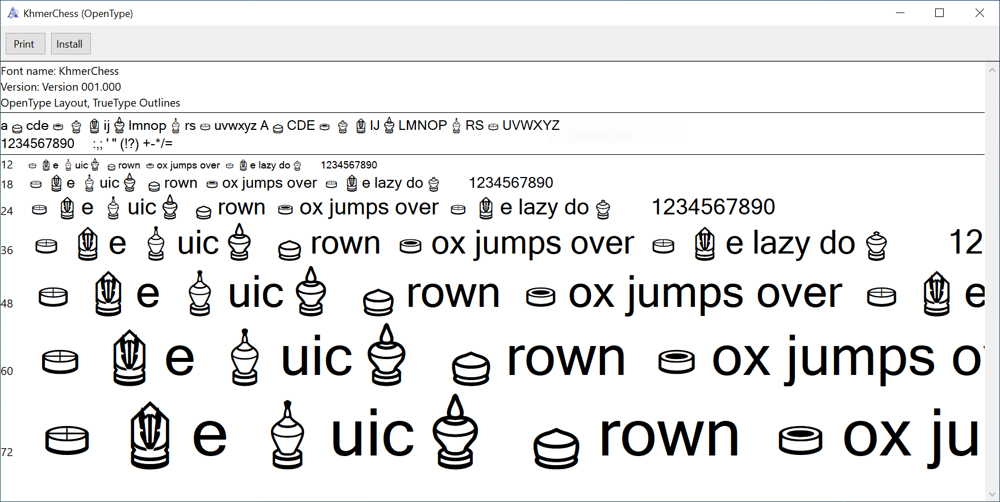

# Khmer Chess Font



[Font Formats](https://css-tricks.com/understanding-web-fonts-getting/#font-formats)

* SVG `exported/KhmerChess.svg`
* TrueType `exported/KhmerChess.ttf`
* Web Open Font Format `exported/KhmerChess.woff`
* Web Open Font Format 2 `exported/KhmerChess.woff2`

[Created With FontForge 2020-11-07](https://fontforge.org/en-US/)

## Get Plain VSG Out

For Mac user only

```base
$ ./font/extract_svg_khmer_chess.sh
```

## Licence

MIT
